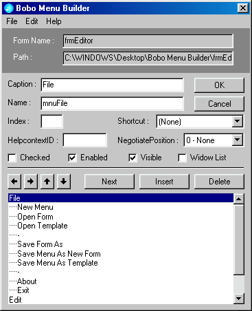



## Menu Builder

### Description

This little App will allow you to edit or create

menus in VB6 Forms. It removes the limitations of the number of nested submenus allowable in the VB6 menu editor on which it is based. New forms can be created with menus in place. It can be used to extract menu structures from one form and place it in another. You can save menu structures as templates for later use. It has only been tested in VB6. Use it as you would the Menu Editor in VB6 with the exception of the Open/Save operations. As with all my submissions, bugs and errors are provided completely free of charge.
 
### More Info
 

             |
---                |---
**Submitted On**   |2001-01-19 19:04:50
**By**             |[MrBobo](https://github.com/Planet-Source-Code/PSCIndex/blob/master/ByAuthor/mrbobo.md)
**Level**          |Intermediate
**User Rating**    |4.4 (22 globes from 5 users)
**Compatibility**  |VB 6\.0
**Category**       |[VB function enhancement](https://github.com/Planet-Source-Code/PSCIndex/blob/master/ByCategory/vb-function-enhancement__1-25.md)
**World**          |[Visual Basic](https://github.com/Planet-Source-Code/PSCIndex/blob/master/ByWorld/visual-basic.md)
**Archive File**   |[CODE\_UPLOAD139111192001\.zip](https://github.com/Planet-Source-Code/mrbobo-menu-builder__1-14527/archive/master.zip)

